# Architecture Overview

## System Architecture

The CVPlus Multimedia Module is designed as a modular, enterprise-grade multimedia processing platform with a clear separation of concerns and strong architectural principles.

## High-Level Architecture

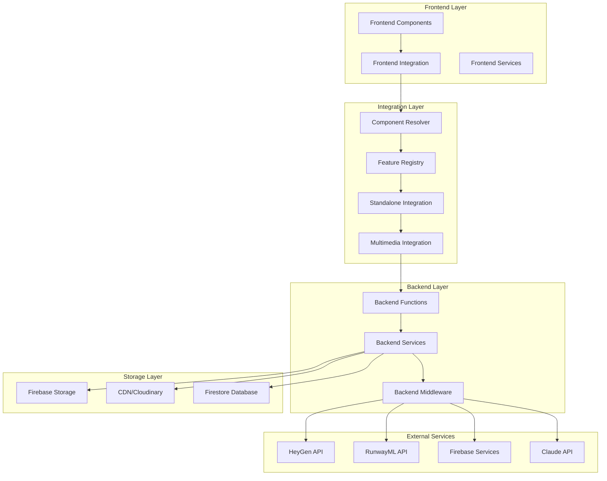

## Core Architectural Principles

### 1. Modular Design
- **Component Isolation**: Each component is self-contained with clear interfaces
- **Service Separation**: Business logic separated from UI concerns
- **Plugin Architecture**: Pluggable providers and services

### 2. Provider Abstraction
- **Multi-Provider Support**: Abstract interfaces for different service providers
- **Intelligent Fallback**: Automatic failover between providers
- **Provider Selection**: Dynamic provider selection based on requirements

### 3. Performance First
- **Lazy Loading**: Components and services loaded on demand
- **Caching Strategy**: Multi-layer caching for optimal performance
- **Bundle Optimization**: Tree-shaking and code splitting

### 4. Error Resilience
- **Circuit Breakers**: Fault tolerance for external services
- **Error Recovery**: Intelligent error handling and recovery
- **Graceful Degradation**: Fallback options when services unavailable

### 5. Type Safety
- **Full TypeScript**: Complete type coverage across all components
- **Interface Contracts**: Strong typing for all service interfaces
- **Runtime Validation**: Type validation at runtime where needed

## Component Architecture

### Frontend Components Hierarchy

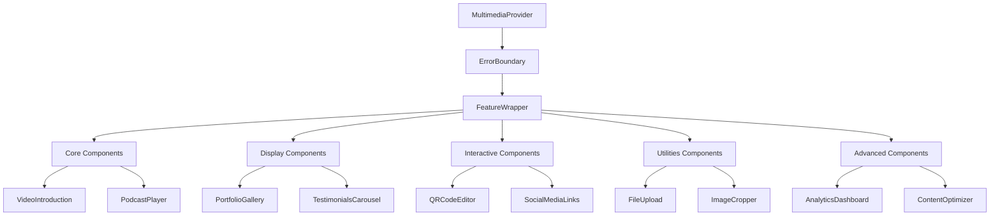

### Service Architecture

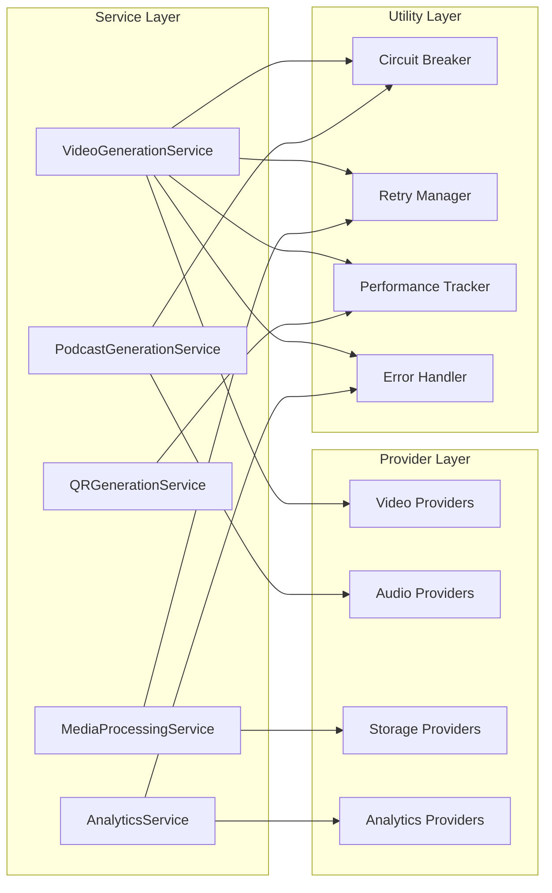

## Backend Architecture

### Firebase Functions Structure

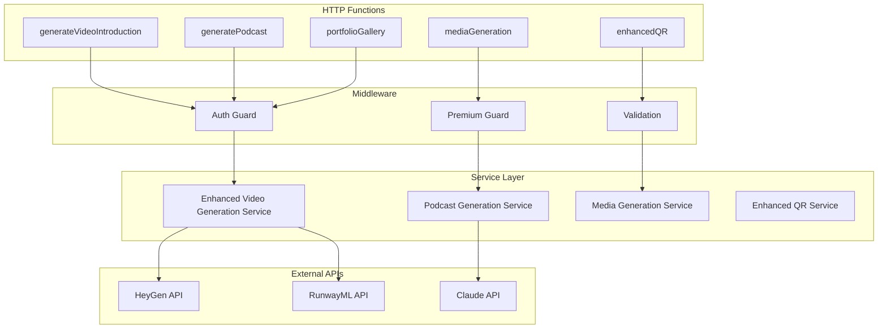

### Service Provider Pattern

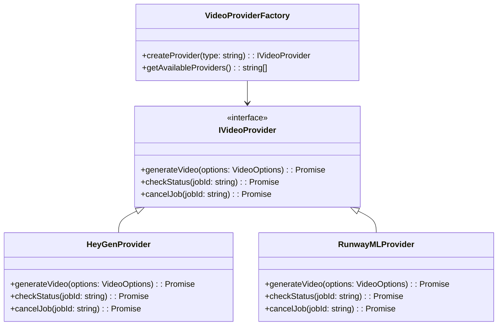

## Data Flow Architecture

### Video Generation Flow

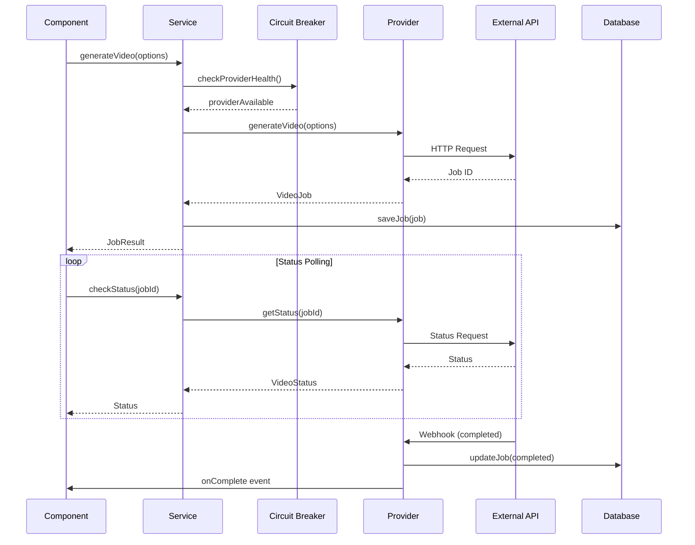

### Error Recovery Flow

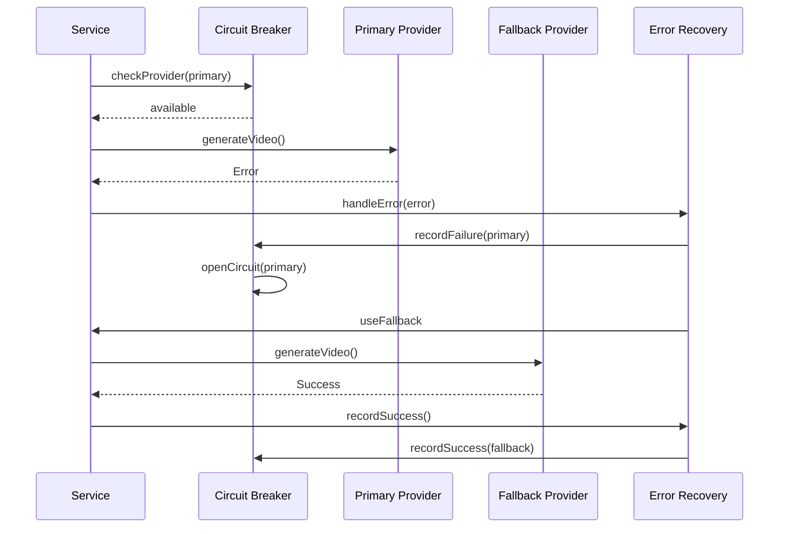

## Integration Architecture

### Component Resolution System

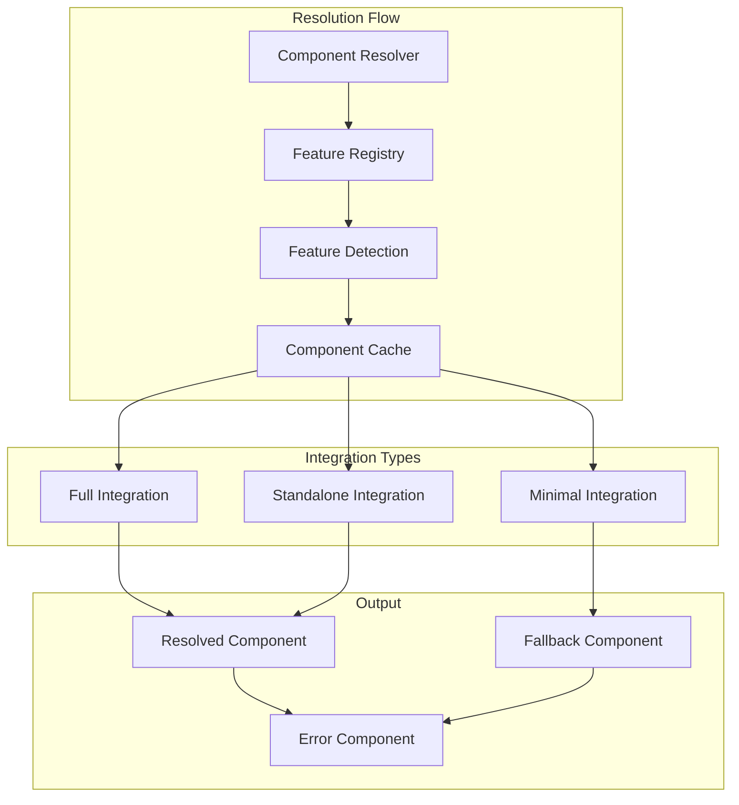

### Feature Flag System

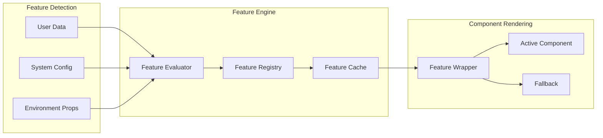

## Performance Architecture

### Caching Strategy

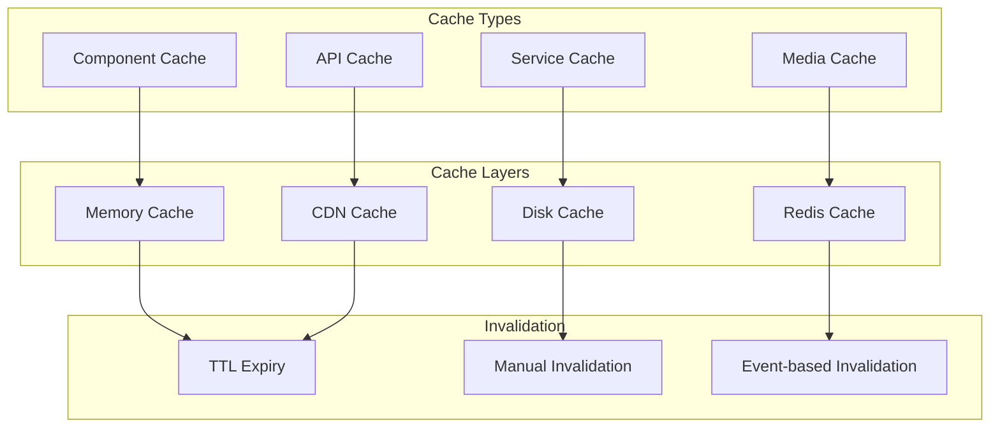

### Bundle Optimization

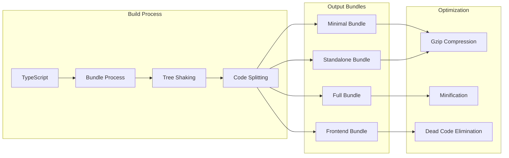

## Security Architecture

### Authentication Flow

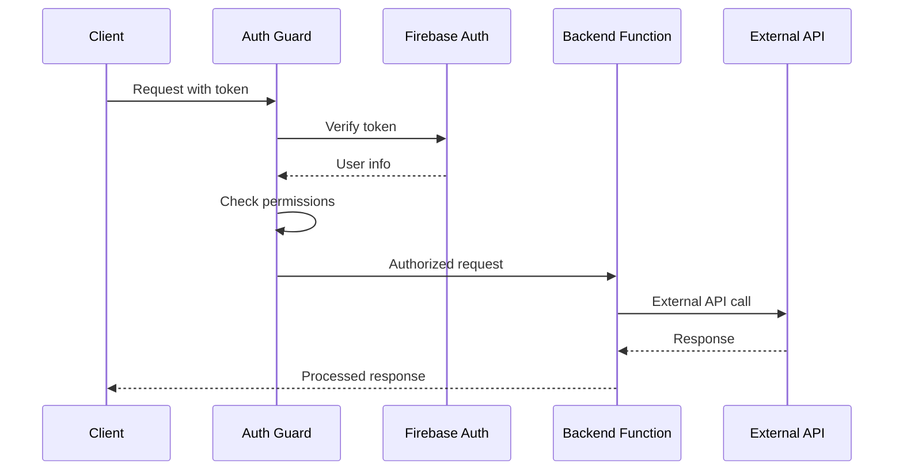

### Data Protection

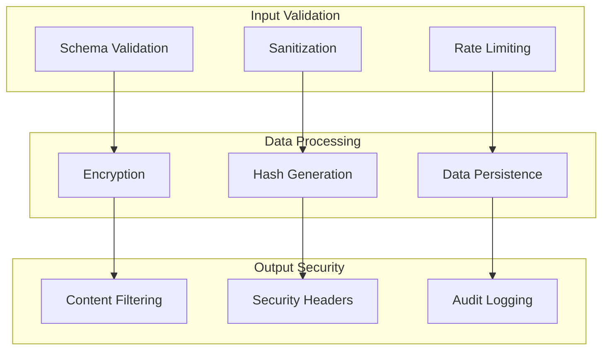

## Deployment Architecture

### Multi-Environment Setup

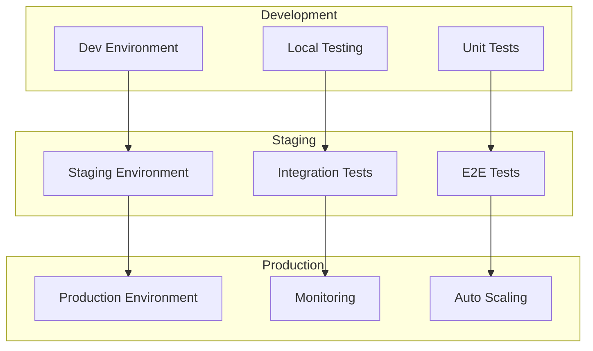

## Monitoring and Observability

### Metrics Collection

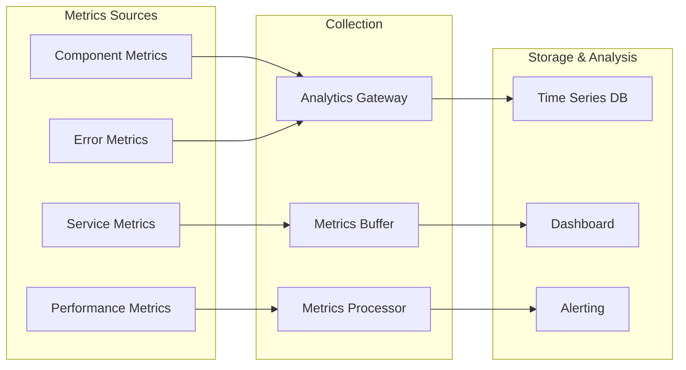

This architecture overview provides the foundation for understanding how all components, services, and systems work together to provide a robust, scalable multimedia platform.