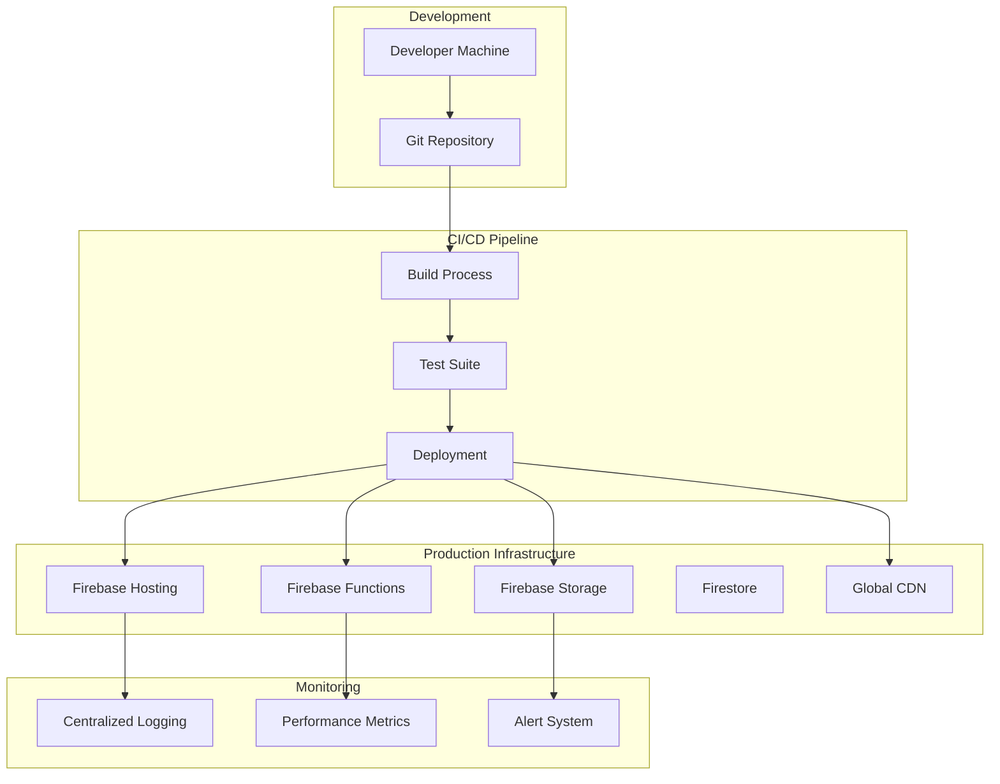

# Deployment Guide

Complete guide for deploying the CVPlus Multimedia Module to production and staging environments.

## Table of Contents

- [Deployment Overview](#deployment-overview)
- [Environment Setup](#environment-setup)
- [Firebase Deployment](#firebase-deployment)
- [CDN Deployment](#cdn-deployment)
- [Docker Deployment](#docker-deployment)
- [CI/CD Pipeline](#cicd-pipeline)
- [Monitoring and Logging](#monitoring-and-logging)
- [Rollback Procedures](#rollback-procedures)
- [Performance Optimization](#performance-optimization)
- [Security Configuration](#security-configuration)

## Deployment Overview

### Deployment Targets

The CVPlus Multimedia Module supports multiple deployment scenarios:

1. **Firebase Hosting + Functions** (Recommended)
2. **NPM Package Distribution**
3. **CDN Distribution**
4. **Docker Containerization**
5. **Standalone Server Deployment**

### Architecture Overview



## Environment Setup

### Environment Variables

Create environment-specific configuration files:

#### Development (.env.development)
```bash
# Firebase Configuration
REACT_APP_FIREBASE_API_KEY=dev_firebase_api_key
REACT_APP_FIREBASE_AUTH_DOMAIN=multimedia-dev.firebaseapp.com
REACT_APP_FIREBASE_PROJECT_ID=multimedia-dev
REACT_APP_FIREBASE_STORAGE_BUCKET=multimedia-dev.appspot.com

# External Service APIs
REACT_APP_HEYGEN_API_KEY=dev_heygen_api_key
REACT_APP_RUNWAYML_API_KEY=dev_runwayml_api_key
REACT_APP_CLAUDE_API_KEY=dev_claude_api_key

# Feature Flags
REACT_APP_ENABLE_ANALYTICS=false
REACT_APP_ENABLE_ADVANCED_FEATURES=false
REACT_APP_DEBUG_MODE=true

# Performance Settings
REACT_APP_CACHE_TIMEOUT=60000
REACT_APP_MAX_RETRY_ATTEMPTS=1
```

#### Staging (.env.staging)
```bash
# Firebase Configuration
REACT_APP_FIREBASE_API_KEY=staging_firebase_api_key
REACT_APP_FIREBASE_AUTH_DOMAIN=multimedia-staging.firebaseapp.com
REACT_APP_FIREBASE_PROJECT_ID=multimedia-staging
REACT_APP_FIREBASE_STORAGE_BUCKET=multimedia-staging.appspot.com

# External Service APIs
REACT_APP_HEYGEN_API_KEY=staging_heygen_api_key
REACT_APP_RUNWAYML_API_KEY=staging_runwayml_api_key
REACT_APP_CLAUDE_API_KEY=staging_claude_api_key

# Feature Flags
REACT_APP_ENABLE_ANALYTICS=true
REACT_APP_ENABLE_ADVANCED_FEATURES=true
REACT_APP_DEBUG_MODE=false

# Performance Settings
REACT_APP_CACHE_TIMEOUT=300000
REACT_APP_MAX_RETRY_ATTEMPTS=3
```

#### Production (.env.production)
```bash
# Firebase Configuration
REACT_APP_FIREBASE_API_KEY=prod_firebase_api_key
REACT_APP_FIREBASE_AUTH_DOMAIN=multimedia.cvplus.io
REACT_APP_FIREBASE_PROJECT_ID=cvplus-multimedia
REACT_APP_FIREBASE_STORAGE_BUCKET=cvplus-multimedia.appspot.com

# External Service APIs (Stored in Firebase Functions Config)
# firebase functions:config:set heygen.key="prod_heygen_api_key"
# firebase functions:config:set runwayml.key="prod_runwayml_api_key"
# firebase functions:config:set claude.key="prod_claude_api_key"

# Feature Flags
REACT_APP_ENABLE_ANALYTICS=true
REACT_APP_ENABLE_ADVANCED_FEATURES=true
REACT_APP_DEBUG_MODE=false

# Performance Settings
REACT_APP_CACHE_TIMEOUT=600000
REACT_APP_MAX_RETRY_ATTEMPTS=5
```

### Firebase Configuration

#### firebase.json (Complete Configuration)
```json
{
  "hosting": {
    "public": "dist",
    "ignore": ["firebase.json", "**/.*", "**/node_modules/**"],
    "rewrites": [
      {
        "source": "**",
        "destination": "/index.html"
      }
    ],
    "headers": [
      {
        "source": "**/*.@(js|jsx|ts|tsx)",
        "headers": [
          {
            "key": "Cache-Control",
            "value": "public, max-age=31536000, immutable"
          }
        ]
      },
      {
        "source": "**/*.@(css|scss)",
        "headers": [
          {
            "key": "Cache-Control",
            "value": "public, max-age=31536000, immutable"
          }
        ]
      },
      {
        "source": "**/*.@(png|jpg|jpeg|gif|ico|svg|webp)",
        "headers": [
          {
            "key": "Cache-Control",
            "value": "public, max-age=31536000, immutable"
          }
        ]
      },
      {
        "source": "**/*.@(mp4|webm|ogg|mp3|wav|flac|aac)",
        "headers": [
          {
            "key": "Cache-Control",
            "value": "public, max-age=86400"
          }
        ]
      }
    ]
  },
  "functions": {
    "source": "functions",
    "runtime": "nodejs18",
    "memory": "1GB",
    "timeout": "540s",
    "env": {
      "NODE_ENV": "production"
    }
  },
  "firestore": {
    "rules": "firestore.rules",
    "indexes": "firestore.indexes.json"
  },
  "storage": {
    "rules": "storage.rules"
  }
}
```

#### Firestore Rules (firestore.rules)
```javascript
rules_version = '2';
service cloud.firestore {
  match /databases/{database}/documents {
    // User-specific multimedia data
    match /users/{userId}/multimedia/{document=**} {
      allow read, write: if request.auth != null && request.auth.uid == userId;
    }
    
    // Public multimedia content
    match /public/multimedia/{document=**} {
      allow read: if true;
      allow write: if request.auth != null;
    }
    
    // Video generation jobs
    match /video-jobs/{jobId} {
      allow read, write: if request.auth != null 
        && request.auth.uid == resource.data.userId;
      allow create: if request.auth != null 
        && request.auth.uid == request.resource.data.userId;
    }
    
    // Podcast generation jobs
    match /podcast-jobs/{jobId} {
      allow read, write: if request.auth != null 
        && request.auth.uid == resource.data.userId;
      allow create: if request.auth != null 
        && request.auth.uid == request.resource.data.userId;
    }
    
    // Analytics data (admin only)
    match /analytics/{document=**} {
      allow read, write: if request.auth != null 
        && request.auth.token.admin == true;
    }
  }
}
```

#### Storage Rules (storage.rules)
```javascript
rules_version = '2';
service firebase.storage {
  match /b/{bucket}/o {
    // User multimedia files
    match /users/{userId}/{allPaths=**} {
      allow read, write: if request.auth != null && request.auth.uid == userId;
    }
    
    // Public multimedia files
    match /public/{allPaths=**} {
      allow read: if true;
      allow write: if request.auth != null;
    }
    
    // Generated videos
    match /generated/videos/{userId}/{videoId}/{allPaths=**} {
      allow read: if request.auth != null;
      allow write: if request.auth != null && request.auth.uid == userId;
    }
    
    // Generated podcasts
    match /generated/podcasts/{userId}/{podcastId}/{allPaths=**} {
      allow read: if request.auth != null;
      allow write: if request.auth != null && request.auth.uid == userId;
    }
    
    // Temporary uploads (24 hour expiry)
    match /temp/{allPaths=**} {
      allow read, write: if request.auth != null 
        && request.time < resource.timeCreated.addDays(1);
    }
  }
}
```

## Firebase Deployment

### Automated Deployment Script

Create a comprehensive deployment script:

```bash
#!/bin/bash
# deploy.sh - Automated Firebase Deployment Script

set -e  # Exit on any error

# Configuration
ENVIRONMENT=${1:-staging}
VERSION=$(node -p "require('./package.json').version")
TIMESTAMP=$(date -u +"%Y%m%d_%H%M%S")
DEPLOYMENT_ID="${VERSION}_${TIMESTAMP}"

echo "🚀 Starting CVPlus Multimedia Module Deployment"
echo "📋 Environment: $ENVIRONMENT"
echo "📦 Version: $VERSION"
echo "🕐 Timestamp: $TIMESTAMP"
echo "🆔 Deployment ID: $DEPLOYMENT_ID"
echo ""

# Pre-deployment checks
echo "🔍 Running pre-deployment checks..."

# Check if Firebase CLI is installed
if ! command -v firebase &> /dev/null; then
    echo "❌ Firebase CLI not found. Please install: npm install -g firebase-tools"
    exit 1
fi

# Check if user is logged in
if ! firebase projects:list > /dev/null 2>&1; then
    echo "❌ Not logged into Firebase. Please run: firebase login"
    exit 1
fi

# Verify environment file exists
if [[ ! -f ".env.${ENVIRONMENT}" ]]; then
    echo "❌ Environment file .env.${ENVIRONMENT} not found"
    exit 1
fi

echo "✅ Pre-deployment checks passed"
echo ""

# Build process
echo "🔨 Building application..."

# Install dependencies
echo "📦 Installing dependencies..."
npm ci --silent

# Run tests
echo "🧪 Running test suite..."
npm run test:ci

# Type checking
echo "🔍 Running TypeScript checks..."
npm run type-check

# Linting
echo "🧹 Running linter..."
npm run lint

# Build for target environment
echo "🏗️ Building for ${ENVIRONMENT}..."
if [[ "$ENVIRONMENT" == "production" ]]; then
    npm run build:production
elif [[ "$ENVIRONMENT" == "staging" ]]; then
    npm run build:staging
else
    npm run build:development
fi

echo "✅ Build completed successfully"
echo ""

# Firebase configuration
echo "🔧 Configuring Firebase..."

# Switch to target project
if [[ "$ENVIRONMENT" == "production" ]]; then
    firebase use production
elif [[ "$ENVIRONMENT" == "staging" ]]; then
    firebase use staging
else
    firebase use development
fi

# Set function environment variables
echo "🔑 Setting function configuration..."
firebase functions:config:set \
    environment.name="$ENVIRONMENT" \
    deployment.id="$DEPLOYMENT_ID" \
    deployment.version="$VERSION" \
    deployment.timestamp="$TIMESTAMP"

echo "✅ Firebase configuration completed"
echo ""

# Deploy functions first (zero downtime)
echo "☁️ Deploying Firebase Functions..."
firebase deploy --only functions --force

# Verify functions are working
echo "🔍 Verifying function deployment..."
sleep 10  # Wait for functions to initialize

# Test critical functions
FUNCTION_BASE_URL="https://us-central1-$(firebase use).cloudfunctions.net"
HEALTH_CHECK="${FUNCTION_BASE_URL}/healthCheck"

if curl -f -s "$HEALTH_CHECK" > /dev/null; then
    echo "✅ Functions are healthy"
else
    echo "❌ Function health check failed"
    echo "🔄 Rolling back functions..."
    firebase functions:log --limit 50
    exit 1
fi

# Deploy Firestore rules and indexes
echo "🗃️ Deploying Firestore configuration..."
firebase deploy --only firestore

# Deploy Storage rules
echo "💾 Deploying Storage rules..."
firebase deploy --only storage

# Deploy hosting (this will update the frontend)
echo "🌐 Deploying to Firebase Hosting..."
firebase deploy --only hosting

echo "✅ Deployment completed successfully!"
echo ""

# Post-deployment verification
echo "🔍 Running post-deployment verification..."

# Check hosting deployment
HOSTING_URL="https://$(firebase use).web.app"
if curl -f -s "$HOSTING_URL" > /dev/null; then
    echo "✅ Hosting is accessible"
else
    echo "❌ Hosting verification failed"
    exit 1
fi

# Verify key functionality
echo "🧪 Running smoke tests..."
npm run test:smoke:$ENVIRONMENT

echo "✅ Post-deployment verification completed"
echo ""

# Update version tags
echo "🏷️ Tagging deployment..."
git tag -a "v${VERSION}-${ENVIRONMENT}" -m "Deployment ${DEPLOYMENT_ID} to ${ENVIRONMENT}"
git push origin "v${VERSION}-${ENVIRONMENT}"

# Send deployment notification (if configured)
if [[ -n "$SLACK_WEBHOOK_URL" ]]; then
    curl -X POST -H 'Content-type: application/json' \
        --data "{\"text\":\"🚀 CVPlus Multimedia deployed to ${ENVIRONMENT}\\nVersion: ${VERSION}\\nDeployment ID: ${DEPLOYMENT_ID}\"}" \
        "$SLACK_WEBHOOK_URL"
fi

echo "🎉 Deployment completed successfully!"
echo "📊 Summary:"
echo "   Environment: $ENVIRONMENT"
echo "   Version: $VERSION"
echo "   Deployment ID: $DEPLOYMENT_ID"
echo "   URL: $HOSTING_URL"
echo ""
```

### Manual Deployment Steps

For manual deployments or troubleshooting:

#### 1. Prepare Environment

```bash
# Install dependencies
npm ci

# Set environment
export NODE_ENV=production
export ENVIRONMENT=production

# Load environment variables
source .env.production
```

#### 2. Build Application

```bash
# Run full build process
npm run build:production

# Verify build output
ls -la dist/

# Check build size
npm run analyze:bundle
```

#### 3. Deploy Components

```bash
# Login to Firebase (if not already logged in)
firebase login

# Select project
firebase use production

# Deploy functions only
firebase deploy --only functions

# Deploy Firestore rules
firebase deploy --only firestore:rules

# Deploy Storage rules
firebase deploy --only storage:rules

# Deploy hosting
firebase deploy --only hosting

# Or deploy everything
firebase deploy
```

#### 4. Verify Deployment

```bash
# Check function status
firebase functions:log --limit 20

# Test endpoints
curl https://us-central1-your-project.cloudfunctions.net/healthCheck

# Check hosting
curl https://your-project.web.app
```

## CDN Deployment

### Cloudflare Configuration

For global CDN distribution:

```javascript
// cloudflare-deploy.js
const cloudflare = require('cloudflare')

const cf = cloudflare({
  token: process.env.CLOUDFLARE_API_TOKEN
})

async function deployToCDN() {
  try {
    // Upload assets to Cloudflare Workers KV
    await cf.enterpriseZoneWorkersKvNamespaces.browse(
      process.env.CLOUDFLARE_ZONE_ID,
      process.env.CLOUDFLARE_NAMESPACE_ID
    )
    
    // Update worker script
    await cf.workers.scripts.upload({
      script: readFileSync('./dist/worker.js', 'utf8'),
      metadata: {
        body_part: 'script',
        bindings: [
          {
            name: 'MULTIMEDIA_ASSETS',
            type: 'kv_namespace',
            namespace_id: process.env.CLOUDFLARE_NAMESPACE_ID
          }
        ]
      }
    })
    
    console.log('✅ CDN deployment completed')
  } catch (error) {
    console.error('❌ CDN deployment failed:', error)
    process.exit(1)
  }
}

deployToCDN()
```

### NPM Package Deployment

For distributing as an NPM package:

```json
{
  "name": "@cvplus/multimedia",
  "version": "2.3.0",
  "description": "CVPlus Multimedia Module",
  "main": "dist/index.js",
  "module": "dist/index.esm.js",
  "types": "dist/index.d.ts",
  "files": [
    "dist/**/*",
    "README.md",
    "LICENSE"
  ],
  "publishConfig": {
    "access": "public",
    "registry": "https://registry.npmjs.org/"
  },
  "scripts": {
    "prepublish": "npm run build:all",
    "publish:beta": "npm publish --tag beta",
    "publish:latest": "npm publish --tag latest"
  }
}
```

```bash
#!/bin/bash
# npm-deploy.sh

# Automated NPM deployment
VERSION=$(node -p "require('./package.json').version")

echo "📦 Publishing @cvplus/multimedia v${VERSION}"

# Build all targets
npm run build:all

# Run final tests
npm run test:all

# Publish to NPM
if [[ "$1" == "beta" ]]; then
    npm publish --tag beta
else
    npm publish --tag latest
fi

echo "✅ Published successfully!"
```

## Docker Deployment

### Multi-stage Dockerfile

```dockerfile
# Multi-stage build for optimal image size
FROM node:18-alpine AS builder

# Set working directory
WORKDIR /app

# Copy package files
COPY package*.json ./
COPY tsconfig*.json ./

# Install dependencies
RUN npm ci --only=production

# Copy source code
COPY src/ ./src/
COPY public/ ./public/

# Build application
RUN npm run build:production

# Production stage
FROM nginx:alpine AS production

# Copy built application
COPY --from=builder /app/dist /usr/share/nginx/html

# Copy nginx configuration
COPY nginx.conf /etc/nginx/conf.d/default.conf

# Add health check
HEALTHCHECK --interval=30s --timeout=3s --start-period=5s --retries=3 \
    CMD curl -f http://localhost/health || exit 1

# Expose port
EXPOSE 80

# Start nginx
CMD ["nginx", "-g", "daemon off;"]
```

### Docker Compose Configuration

```yaml
# docker-compose.yml
version: '3.8'

services:
  multimedia-app:
    build:
      context: .
      dockerfile: Dockerfile
      target: production
    ports:
      - "80:80"
      - "443:443"
    environment:
      - NODE_ENV=production
    volumes:
      - ./ssl:/etc/nginx/ssl:ro
    networks:
      - multimedia-network
    restart: unless-stopped
    
  multimedia-functions:
    build:
      context: ./functions
      dockerfile: Dockerfile
    environment:
      - NODE_ENV=production
      - FIREBASE_CONFIG=${FIREBASE_CONFIG}
    networks:
      - multimedia-network
    restart: unless-stopped
    
  redis-cache:
    image: redis:7-alpine
    ports:
      - "6379:6379"
    volumes:
      - redis-data:/data
    networks:
      - multimedia-network
    restart: unless-stopped

networks:
  multimedia-network:
    driver: bridge

volumes:
  redis-data:
```

### Kubernetes Deployment

```yaml
# k8s-deployment.yaml
apiVersion: apps/v1
kind: Deployment
metadata:
  name: cvplus-multimedia
  labels:
    app: cvplus-multimedia
spec:
  replicas: 3
  selector:
    matchLabels:
      app: cvplus-multimedia
  template:
    metadata:
      labels:
        app: cvplus-multimedia
    spec:
      containers:
      - name: multimedia-app
        image: cvplus/multimedia:latest
        ports:
        - containerPort: 80
        env:
        - name: NODE_ENV
          value: "production"
        - name: FIREBASE_CONFIG
          valueFrom:
            secretKeyRef:
              name: firebase-config
              key: config.json
        resources:
          requests:
            memory: "256Mi"
            cpu: "250m"
          limits:
            memory: "512Mi"
            cpu: "500m"
        livenessProbe:
          httpGet:
            path: /health
            port: 80
          initialDelaySeconds: 30
          periodSeconds: 10
        readinessProbe:
          httpGet:
            path: /ready
            port: 80
          initialDelaySeconds: 5
          periodSeconds: 5

---
apiVersion: v1
kind: Service
metadata:
  name: cvplus-multimedia-service
spec:
  selector:
    app: cvplus-multimedia
  ports:
    - protocol: TCP
      port: 80
      targetPort: 80
  type: LoadBalancer
```

## CI/CD Pipeline

### GitHub Actions Workflow

```yaml
# .github/workflows/deploy.yml
name: Deploy CVPlus Multimedia

on:
  push:
    branches: [main, develop]
  pull_request:
    branches: [main]

env:
  NODE_VERSION: '18'
  CACHE_KEY: node-modules-${{ hashFiles('**/package-lock.json') }}

jobs:
  test:
    runs-on: ubuntu-latest
    steps:
      - name: Checkout code
        uses: actions/checkout@v3
        
      - name: Setup Node.js
        uses: actions/setup-node@v3
        with:
          node-version: ${{ env.NODE_VERSION }}
          cache: 'npm'
          
      - name: Install dependencies
        run: npm ci
        
      - name: Run type checking
        run: npm run type-check
        
      - name: Run linting
        run: npm run lint
        
      - name: Run unit tests
        run: npm run test:coverage
        
      - name: Upload coverage to Codecov
        uses: codecov/codecov-action@v3
        
  build:
    needs: test
    runs-on: ubuntu-latest
    strategy:
      matrix:
        build-target: [minimal, full, frontend, standalone]
    steps:
      - name: Checkout code
        uses: actions/checkout@v3
        
      - name: Setup Node.js
        uses: actions/setup-node@v3
        with:
          node-version: ${{ env.NODE_VERSION }}
          cache: 'npm'
          
      - name: Install dependencies
        run: npm ci
        
      - name: Build ${{ matrix.build-target }}
        run: npm run build:${{ matrix.build-target }}
        
      - name: Upload build artifacts
        uses: actions/upload-artifact@v3
        with:
          name: build-${{ matrix.build-target }}
          path: dist/
          retention-days: 7

  deploy-staging:
    needs: [test, build]
    runs-on: ubuntu-latest
    if: github.ref == 'refs/heads/develop'
    environment: staging
    steps:
      - name: Checkout code
        uses: actions/checkout@v3
        
      - name: Setup Node.js
        uses: actions/setup-node@v3
        with:
          node-version: ${{ env.NODE_VERSION }}
          cache: 'npm'
          
      - name: Install dependencies
        run: npm ci
        
      - name: Download build artifacts
        uses: actions/download-artifact@v3
        with:
          name: build-full
          path: dist/
          
      - name: Deploy to Firebase Staging
        uses: FirebaseExtended/action-hosting-deploy@v0
        with:
          repoToken: '${{ secrets.GITHUB_TOKEN }}'
          firebaseServiceAccount: '${{ secrets.FIREBASE_SERVICE_ACCOUNT_STAGING }}'
          projectId: multimedia-staging
          channelId: live

  deploy-production:
    needs: [test, build]
    runs-on: ubuntu-latest
    if: github.ref == 'refs/heads/main'
    environment: production
    steps:
      - name: Checkout code
        uses: actions/checkout@v3
        
      - name: Setup Node.js
        uses: actions/setup-node@v3
        with:
          node-version: ${{ env.NODE_VERSION }}
          cache: 'npm'
          
      - name: Install dependencies
        run: npm ci
        
      - name: Download build artifacts
        uses: actions/download-artifact@v3
        with:
          name: build-full
          path: dist/
          
      - name: Run production tests
        run: npm run test:production
        
      - name: Deploy to Firebase Production
        uses: FirebaseExtended/action-hosting-deploy@v0
        with:
          repoToken: '${{ secrets.GITHUB_TOKEN }}'
          firebaseServiceAccount: '${{ secrets.FIREBASE_SERVICE_ACCOUNT_PRODUCTION }}'
          projectId: cvplus-multimedia
          channelId: live
          
      - name: Publish to NPM
        run: |
          echo "//registry.npmjs.org/:_authToken=${{ secrets.NPM_TOKEN }}" > ~/.npmrc
          npm publish --access public
          
      - name: Create GitHub release
        uses: actions/create-release@v1
        env:
          GITHUB_TOKEN: ${{ secrets.GITHUB_TOKEN }}
        with:
          tag_name: v${{ github.run_number }}
          release_name: Release v${{ github.run_number }}
          draft: false
          prerelease: false

  security-scan:
    runs-on: ubuntu-latest
    steps:
      - name: Checkout code
        uses: actions/checkout@v3
        
      - name: Run security audit
        run: npm audit --audit-level=moderate
        
      - name: Run Snyk security scan
        uses: snyk/actions/node@master
        env:
          SNYK_TOKEN: ${{ secrets.SNYK_TOKEN }}
```

## Monitoring and Logging

### Application Monitoring Setup

```typescript
// monitoring.ts
import { initializeApp } from 'firebase/app'
import { getAnalytics, logEvent } from 'firebase/analytics'
import { getPerformance, trace } from 'firebase/performance'

class MultimediaMonitoring {
  private analytics
  private performance
  
  constructor(firebaseConfig: FirebaseConfig) {
    const app = initializeApp(firebaseConfig)
    this.analytics = getAnalytics(app)
    this.performance = getPerformance(app)
  }
  
  // Performance monitoring
  startTrace(name: string) {
    return trace(this.performance, name)
  }
  
  // User interaction tracking
  trackVideoGeneration(provider: string, duration: number, success: boolean) {
    logEvent(this.analytics, 'video_generation', {
      provider,
      duration,
      success
    })
  }
  
  // Error tracking
  trackError(error: Error, context: Record<string, any>) {
    logEvent(this.analytics, 'multimedia_error', {
      error_name: error.name,
      error_message: error.message,
      ...context
    })
  }
  
  // Performance metrics
  trackPerformance(metric: string, value: number, unit: string) {
    logEvent(this.analytics, 'performance_metric', {
      metric,
      value,
      unit
    })
  }
}

export const monitoring = new MultimediaMonitoring(firebaseConfig)
```

### Centralized Logging

```typescript
// logger.ts
import { getFirestore, collection, addDoc } from 'firebase/firestore'

export class Logger {
  private firestore = getFirestore()
  
  async log(level: 'info' | 'warn' | 'error', message: string, metadata?: any) {
    const logEntry = {
      level,
      message,
      metadata,
      timestamp: new Date(),
      userId: getCurrentUser()?.uid,
      sessionId: getSessionId(),
      version: process.env.REACT_APP_VERSION
    }
    
    // Log to console in development
    if (process.env.NODE_ENV === 'development') {
      console[level](message, metadata)
    }
    
    // Send to Firestore in production
    if (process.env.NODE_ENV === 'production') {
      try {
        await addDoc(collection(this.firestore, 'logs'), logEntry)
      } catch (error) {
        console.error('Failed to write log to Firestore:', error)
      }
    }
  }
  
  info(message: string, metadata?: any) {
    return this.log('info', message, metadata)
  }
  
  warn(message: string, metadata?: any) {
    return this.log('warn', message, metadata)
  }
  
  error(message: string, metadata?: any) {
    return this.log('error', message, metadata)
  }
}

export const logger = new Logger()
```

### Health Check Endpoints

```typescript
// functions/src/health.ts
import * as functions from 'firebase-functions'

export const healthCheck = functions.https.onRequest(async (req, res) => {
  try {
    // Check database connectivity
    const admin = await import('firebase-admin')
    await admin.firestore().collection('health').doc('test').get()
    
    // Check external service connectivity
    const heygenStatus = await checkHeyGenHealth()
    const runwayStatus = await checkRunwayMLHealth()
    
    const health = {
      status: 'healthy',
      timestamp: new Date().toISOString(),
      version: process.env.FUNCTION_VERSION || 'unknown',
      services: {
        firestore: 'healthy',
        heygen: heygenStatus,
        runwayml: runwayStatus
      },
      uptime: process.uptime()
    }
    
    res.status(200).json(health)
  } catch (error) {
    res.status(503).json({
      status: 'unhealthy',
      error: error instanceof Error ? error.message : 'Unknown error',
      timestamp: new Date().toISOString()
    })
  }
})

async function checkHeyGenHealth(): Promise<string> {
  try {
    // Implement HeyGen health check
    return 'healthy'
  } catch {
    return 'unhealthy'
  }
}

async function checkRunwayMLHealth(): Promise<string> {
  try {
    // Implement RunwayML health check  
    return 'healthy'
  } catch {
    return 'unhealthy'
  }
}
```

## Rollback Procedures

### Automated Rollback

```bash
#!/bin/bash
# rollback.sh

ENVIRONMENT=${1:-staging}
TARGET_VERSION=${2}

echo "🔄 Starting rollback for $ENVIRONMENT"

if [[ -z "$TARGET_VERSION" ]]; then
    echo "❌ Please provide target version: ./rollback.sh $ENVIRONMENT v2.2.1"
    exit 1
fi

# Get deployment history
firebase hosting:releases --site $(firebase use)

# Rollback hosting
firebase hosting:rollback --site $(firebase use)

# Rollback functions if needed
if [[ "$3" == "--include-functions" ]]; then
    echo "⚠️  Manual function rollback required"
    echo "1. Check function deployment history"
    echo "2. Deploy previous function version"
fi

echo "✅ Rollback completed for $ENVIRONMENT"
```

### Manual Rollback Steps

1. **Identify Target Version**
   ```bash
   # List recent deployments
   firebase hosting:releases --site your-project
   
   # Check function deployment history
   firebase functions:log --limit 100
   ```

2. **Rollback Hosting**
   ```bash
   # Quick rollback to previous version
   firebase hosting:rollback --site your-project
   
   # Or rollback to specific version
   firebase hosting:rollback --version VERSION_ID --site your-project
   ```

3. **Rollback Functions**
   ```bash
   # Deploy previous function version
   git checkout v2.2.1
   firebase deploy --only functions
   ```

4. **Verify Rollback**
   ```bash
   # Test critical endpoints
   curl https://your-project.web.app/health
   curl https://us-central1-your-project.cloudfunctions.net/healthCheck
   ```

## Security Configuration

### Content Security Policy

```html
<!-- index.html -->
<meta http-equiv="Content-Security-Policy" 
      content="default-src 'self'; 
               script-src 'self' 'unsafe-inline' https://apis.google.com; 
               style-src 'self' 'unsafe-inline' https://fonts.googleapis.com; 
               img-src 'self' data: https:; 
               connect-src 'self' https://api.heygen.com https://api.runwayml.com; 
               media-src 'self' https:; 
               frame-src 'none';">
```

### Environment Security

```bash
# Production security checklist

# 1. Secure environment variables
export NODE_ENV=production
export FIREBASE_CONFIG="$(firebase functions:config:get)"

# 2. Enable security headers
export ENABLE_HTTPS_REDIRECT=true
export ENABLE_SECURITY_HEADERS=true

# 3. Configure rate limiting
export RATE_LIMIT_WINDOW_MS=900000  # 15 minutes
export RATE_LIMIT_MAX_REQUESTS=100

# 4. Set CORS configuration
export CORS_ORIGIN="https://cvplus.io,https://www.cvplus.io"
export CORS_METHODS="GET,POST,PUT,DELETE"
export CORS_ALLOWED_HEADERS="Content-Type,Authorization"
```

This deployment guide provides comprehensive instructions for deploying the CVPlus Multimedia Module to various environments with proper monitoring, security, and rollback procedures.